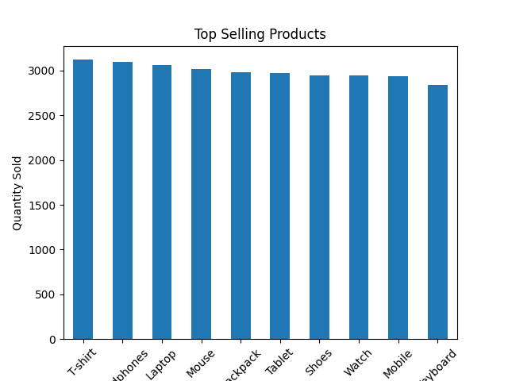
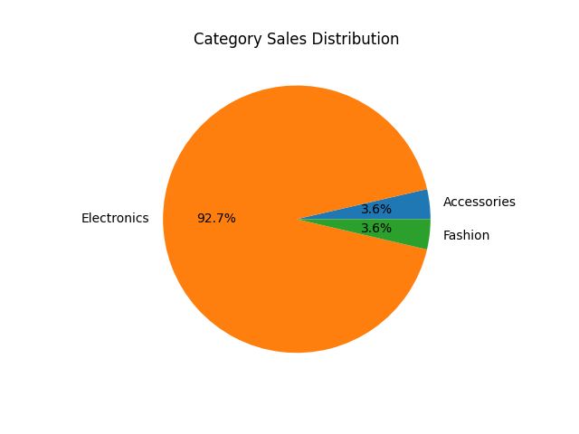
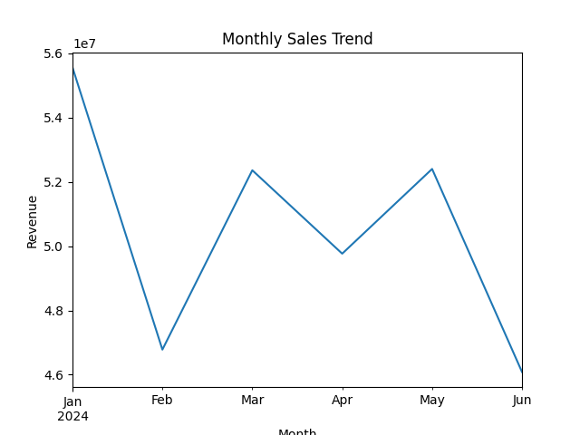
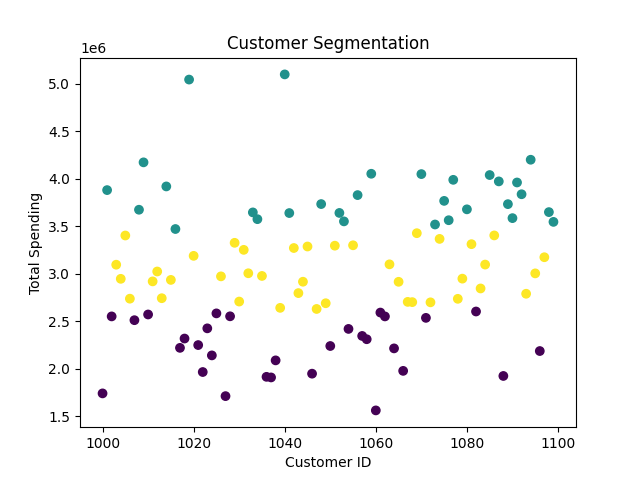
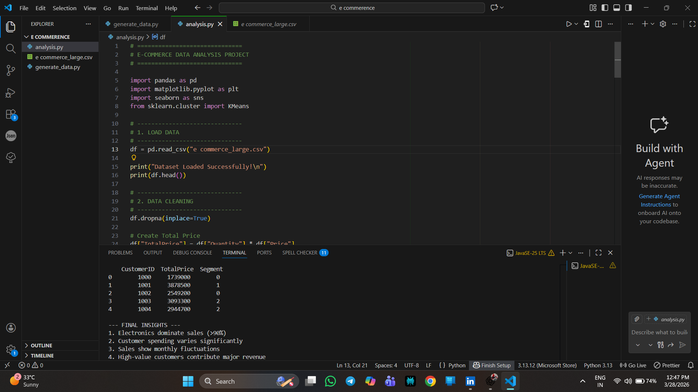

# 📊 E-Commerce Data Analysis Project

## 🚀 Project Overview

This project analyzes e-commerce data using Python to extract meaningful business insights. It includes data cleaning, visualization, and customer segmentation.

---

## 🛠️ Tools & Technologies

* Python
* Pandas
* Matplotlib
* Seaborn
* Scikit-learn

---

## 📊 Features

✔ Data Cleaning & Preprocessing
✔ Sales Trend Analysis
✔ Top Product Analysis
✔ Category-wise Sales Distribution
✔ Customer Segmentation using K-Means

---

## 📈 Key Insights

* Electronics contribute more than 90% of total revenue
* Sales fluctuate across different months
* High-value customers generate major revenue

---

## 🧠 Machine Learning

Implemented **K-Means Clustering** to segment customers based on their spending behavior.

---

## 📷 Project Output

### 📊 Top Products

### 🥧 Category Sales

### 📈 Monthly Sales

### 👥 Customer Segmentation

### 💻 Project Code

---

## 🎯 Conclusion

This project demonstrates practical skills in data analysis, visualization, and machine learning for real-world business problems.

---

## 🔗 Author

Hariharan – Aspiring Data Analyst
